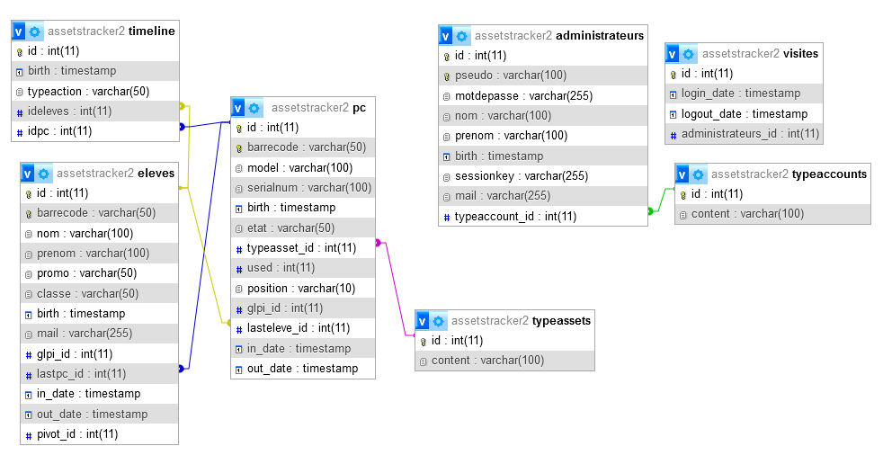

# AssetsTracker

Gestion d'entrées et de sorties materiel avec codebarres.

## Prérequis
### VirtualHost config (serveur side conf)

    <VirtualHost *:80>
        # Définit un hôte virtuel écoutant sur le port 80 (HTTP standard). Le * signifie que l’hôte répond sur toutes les adresses IP configurées pour ce serveur.
        DocumentRoot "C:/sitesweb/TimePoint-Asset-Tracker/public"
        # Spécifie le répertoire racine du site Web pour cet hôte.
        # Ce répertoire contient les fichiers servis par Apache lorsqu’un utilisateur accède au site 
        # (dans ce cas : C:/sitesweb/TimePoint-Asset-Tracker/public).
        ServerName gestionaccueil_dev.pedagogie.lan
        # Définit le nom du serveur pour cet hôte virtuel.
        # Correspond au domaine ou au sous-domaine que les utilisateurs taperont dans leur navigateur
        # (ici : gestionaccueil_dev.pedagogie.lan).
            <Directory "C:/sitesweb/TimePoint-Asset-Tracker/public">
                # Définit la priorité d’évaluation des règles d'accès.
                # Ici, on autorise d'abord (allow) avant de refuser (deny).
                # utilisée dans les versions plus anciennes d'Apache (< 2.4).
                Order allow,deny
                # Autorise l’accès à tout le monde. Tous les clients peuvent accéder au contenu.
                # Allow from all
                # Permet explicitement l'accès à tous les utilisateurs. Cette directive est introduite dans Apache 2.4 et remplace Allow from all.
                Require all granted
        </Directory>
    </VirtualHost>

### Need activation rewrite_module (httpd.conf)

    replace
        #LoadModule rewrite_module modules/mod_rewrite.so
    by
        LoadModule rewrite_module modules/mod_rewrite.so
    
### Need activation rewrite_module (httpd.conf)

    replace
        AllowOverride none
    by
        AllowOverride all

## Modifications
# pour ajouter une page au site

créons la page interface.

dans /public/index.php, créez une route vers la page

    $router->add(
        'nomUrl',
        'nomFichier@nomPublicFonction@null@0@null'
    );

si besoin de la DB

	$router->add(
        'interface',
        'InterfaceController@interfaceHandler@**db**@0@null'
    );

fixer un niveau d'accreditation
le niveau d'admin va de 1 à 3 pour l'instant.

	$router->add(
        'interface',
        'InterfaceController@interfaceHandler@null@**1 à 3**@null'
    );

dans le dossier /app/controllers/

créez le fichier qui correspond au controller de la page à traiter

    /app/controllers/InterfaceController.php

ajouter une vue dans /app/views/

    /app/views/interface.php

ajouter un menu suplémentaire dans la page nagigation.php
on continu avec le meme nomUrl qui est interface
    
    'interface'=> [
        'ico'=>'interface',
        'tag'=> 'a',
        'url'=> 'interface',
        'content'=> 'Options',
        'hiddenIfUrl'=> false,
        'href'=> '/interface',
        'class'=> 'interface',
        'needLog'=> true,
        'lv'=> (int)(1),
        'classHideContent'=>true,
    ],
